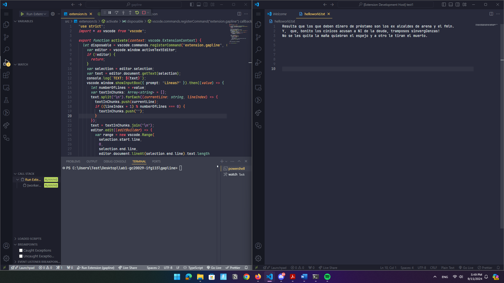
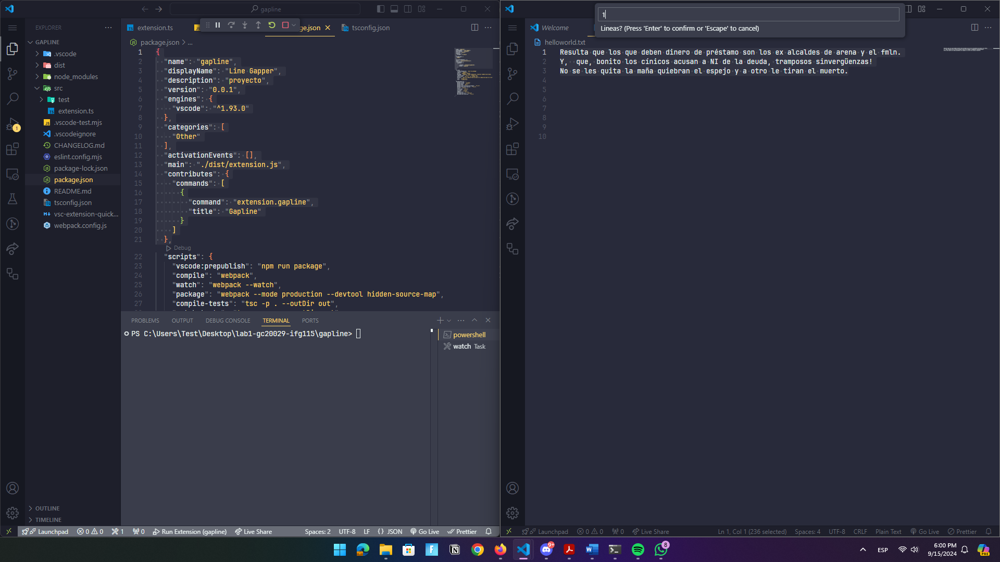
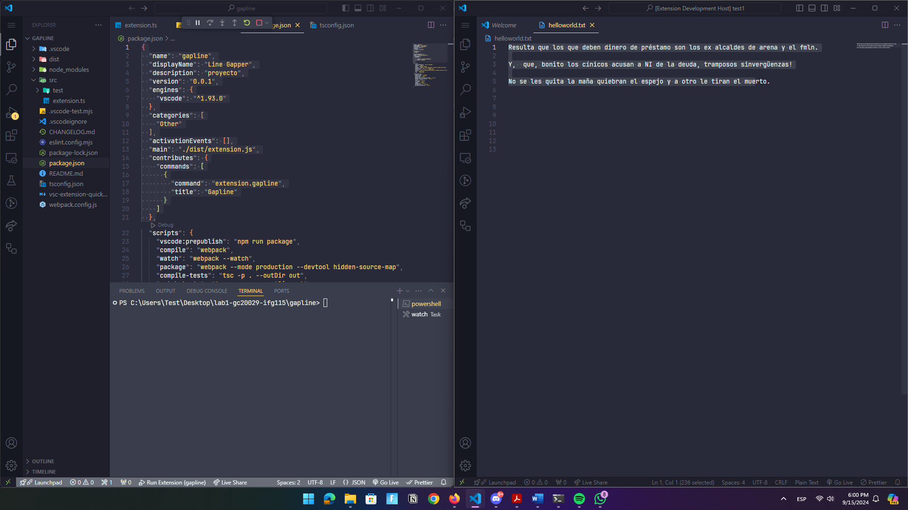

# Part 1: Creación de una extensión para el editor VS Code

Las extensiones en cualquier editor de código son sumamente importantes para el día a día de un programador de software, ya que ayudan agilizar el desarrollo y el cumplimiento de tareas. En esta ocasión vamos a aprender a crear una extensión para VS Code que nos permitirá agregar espacios de n líneas a textos. `Let's get started!`

<!-- If you're new to Markdown, take a look at
[GitHub's Markdown Guide](https://guides.github.com/features/mastering-markdown/).
 -->

## Step 1. Instalación de softwares requeridos.

Necesitaremos dos softwares que nos ayudarán a darle vida a nuestra extensión.

### VS Code
---
Visual Studio Code (VS Code) es un editor de código fuente desarrollado por Microsoft que ha ganado popularidad entre desarrolladores de todo el mundo debido a su flexibilidad, rapidez y la gran cantidad de características que ofrece.

<b>Descarga aquí:</b> [Vs Code](https://code.visualstudio.com/).


### Node JS
---
Es un entorno de ejecución de JavaScript que permite ejecutar código JavaScript fuera del navegador, principalmente en el lado del servidor. Fue creado en 2009 por Ryan Dahl y ha ganado popularidad por su eficiencia y capacidad para manejar aplicaciones de alta concurrencia.

<b>Descarga aquí:</b> [Node JS](https://nodejs.org/en/download/package-manager/current).


## Step 2. Instalación de paquetes NPM requeridos
Instalaremos dos herramientas esenciales mediante npm:

- <b>Yeoman</b>: Generador de proyectos que nos ayudará a crear la estructura de nuestra extensión.

- <b>Generator-code:</b> Herramienta específica para generar extensiones de VS Code.

Ejecuta el siguiente comando en la terminal para instalar estos paquetes:

```bash
npm install -g yo generator-code typescript

```

## Step 3. Generación del esqueleto del proyecto

Utiliza Yeoman CLI  para generar la estructura del proyecto de la extensión

```bash
yo code
```
Cuando se corra el comando les pedirá que configuren el proyecto, a continuación se mostrará la configuración recomendada para esta extensión. 

- Lenguaje de desarrollo: TypeScript
- Nombre de la extensión: Line Gapper
- Identificador: gapline
- Repositorio Git: No necesitamos usar Git para este ejercicio.


## Step 4. Apertura del proyecto en VS Code
Abre el proyecto en VS Code y analiza el listado de archivos que aparecen, el que es de interés para nosotros es el archivo
```extension.ts```

Ese archivo es donde se encuentra el código de ejemplo para la extensión. Reemplazaremos el codigo que muestra Hello World para agregar la funcionalidad de insertar lineas en blanco en textos.


```js

'use strict'; 
// Modo estricto de JavaScript para escribir código más seguro y evitar errores comunes.

import * as vscode from 'vscode'; 

    // Función principal que se ejecuta cuando la extensión es activada. Recibe un contexto que permite registrar comandos y otros recursos.
export function activate(context: vscode.ExtensionContext) { 

    // Registro de un comando llamado 'extension.gapline' que se activará cuando el usuario lo invoque.
    let disposable = vscode.commands.registerCommand('extension.gapline', () => { 

        // Obtiene la instancia del editor de texto activo. Si no hay ningún editor activo, el código no sigue ejecutándose.
        var editor = vscode.window.activeTextEditor; 

        // Si no hay un editor de texto activo, se sale de la función.
        if (!editor) { return; } 

        // Obtiene la selección de texto del editor. Si no hay texto seleccionado, será una posición vacía.
        var selection = editor.selection; 

        // Obtiene el texto seleccionado en el editor de texto.
        var text = editor.document.getText(selection); 

            // Muestra un cuadro de entrada al usuario para que especifique cada cuántas líneas quiere agregar una línea en blanco.
        vscode.window.showInputBox({ prompt: '¿Cada cuántas líneas insertar una línea en blanco?' }).then(value => { 

            // Convierte el valor introducido (que es un string) en un número entero.
            let numberOfLines = +value; 

            // Declara un arreglo que almacenará las líneas del texto original, incluyendo las líneas en blanco añadidas.
            var textInChunks: Array<string> = []; 

                // Divide el texto seleccionado por saltos de línea ('\n') y procesa cada línea individualmente.
            text.split('\n').forEach((currentLine: string, lineIndex) => { 

                // Agrega la línea actual al arreglo `textInChunks`.
                textInChunks.push(currentLine); 

                // Si el índice de la línea es múltiplo de `numberOfLines`, agrega una línea en blanco al arreglo.
                if ((lineIndex + 1) % numberOfLines === 0) textInChunks.push(''); 

            });

            // Une todas las líneas en el arreglo `textInChunks` para formar un nuevo texto con las líneas en blanco añadidas.
            text = textInChunks.join('\n'); 

                // Inicia una operación de edición en el editor. Se usa para aplicar cambios al texto.
            editor.edit((editBuilder) => { 

                // Inicio del rango: la línea donde comienza la selección, desde el primer carácter.
                var range = new vscode.Range( 
                    selection.start.line, 0,  

                    selection.end.line, 

                    editor.document.lineAt(selection.end.line).text.length 

                ); 

                editBuilder.replace(range, text); 
                // Reemplaza el texto en el rango seleccionado por el nuevo texto con las líneas en blanco.

            });

        });
    });

    context.subscriptions.push(disposable); 
    // Agrega el comando registrado a las suscripciones del contexto. Esto asegura que el comando se limpie cuando la extensión se desactiva.
}

export function deactivate() {} 
// Función opcional que se ejecuta cuando la extensión se desactiva. En este caso, está vacía, ya que no hay necesidad de hacer ninguna limpieza específica.


```


<b>Note: Asegurate que en el archivo tsconfig.json se tenga la siguiente configuración.</b>


```json

"compilerOptions": {
    "strict": false
}

```


## Step 5. Ejecución y demostración de la extensión Gapline


#### Antes de iniciar este proceso, cambia el package.json
Asegurate de cambiar las configuraciones por defecto por el nombre del comando que colocamos en extension.ts

```json
{
  "name": "gapline",
  "displayName": "Line Gapper",
  "description": "proyecto",
  "version": "0.0.1",
  "engines": {
    "vscode": "^1.93.0"
  },
  "categories": [
    "Other"
  ],
  "activationEvents": [],
  "main": "./dist/extension.js",
  "contributes": {
    "commands": [
      {
        "command": "extension.gapline",
        "title": "Gapline"
      }
    ]
  }
}
```

#### Ahora crea otra carpeta con un archivo .txt. Nos servirá para poder testear la extensión.

- Para correr la extensión, dirigamonos a Run & Debug en VS Code
- Eligamos el entorno Node Js y luego ```Run Extension```.


- La ventana derecha es nuestro proyecto Gapline corriendo, y en la izquierda el proyecto de prueba.
- Ejecutamos el shortcout: ```Ctrl + Shift + P```
- Nos abrira una ventana donde aparacerá el nombre de nuestra extensión.
- Nos pedira el numero de lineas a insertar, para fines de demostración eligamos el valor de 1.



- Al ejecutar, el resultado sera el siguiente:





## We just created our first VS Code Extenstion 🥳🥳!

<br>
<br>


Desarrollado por: Kevin Armando Grande Chávez 
---
Materia: IGF115 - CICLO II
---
GT: 02
---
Carnet: GC20029
---
</footer>